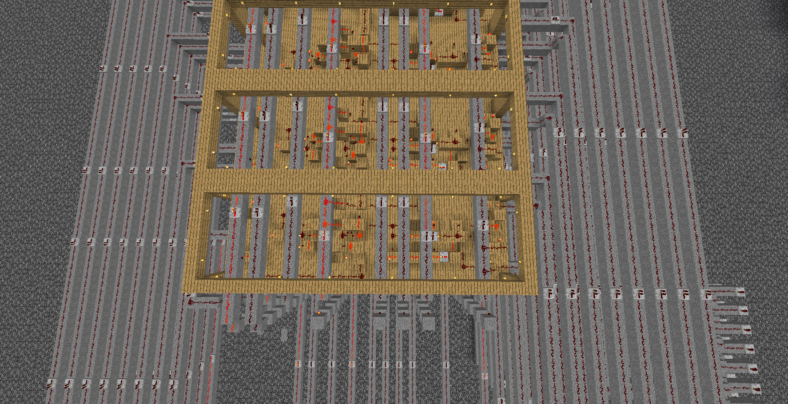

# redstone compiler



From the left side...

- OR := A ∧ B
- NOT := ¬ A
- NOR := ¬ (A ∧ B) := NOT(OR)

https://www.notion.so/redstone-compiler/cdb890c3984a4bb780ba8d30feca029b?v=990dff724b0c414daafb6d459ab4a400&pvs=4

## Block Optimizer

## HDL

### Layering

### Routing

## IR

## Compiler

## Simulator

Build Graph

## Test

```ps1
$env:RUST_LOG="debug"; cargo test unittest_simulator_init_states -- --nocapture
```
